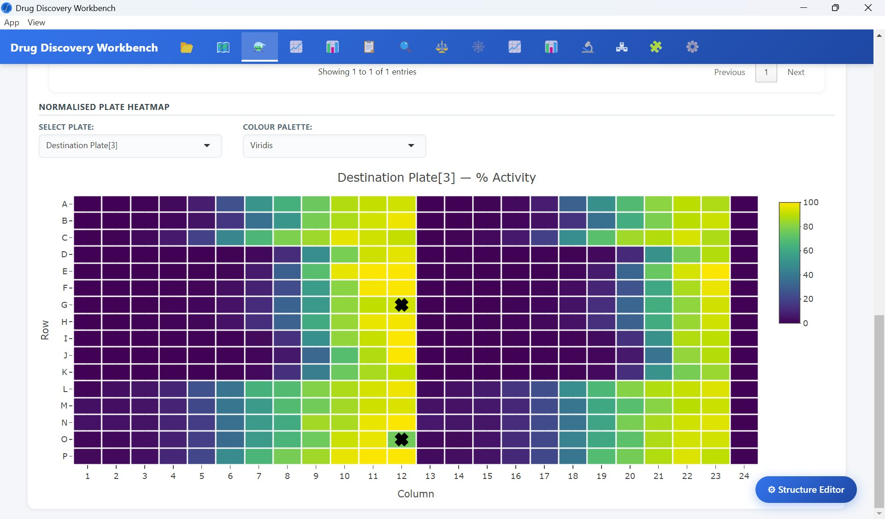
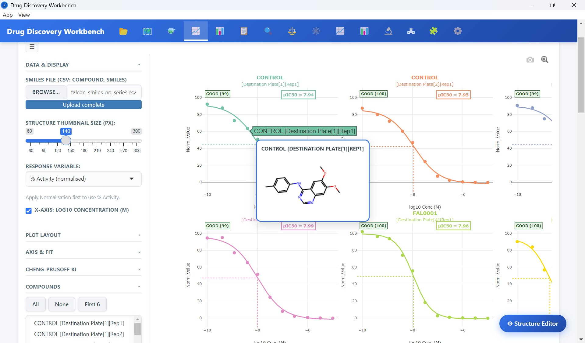
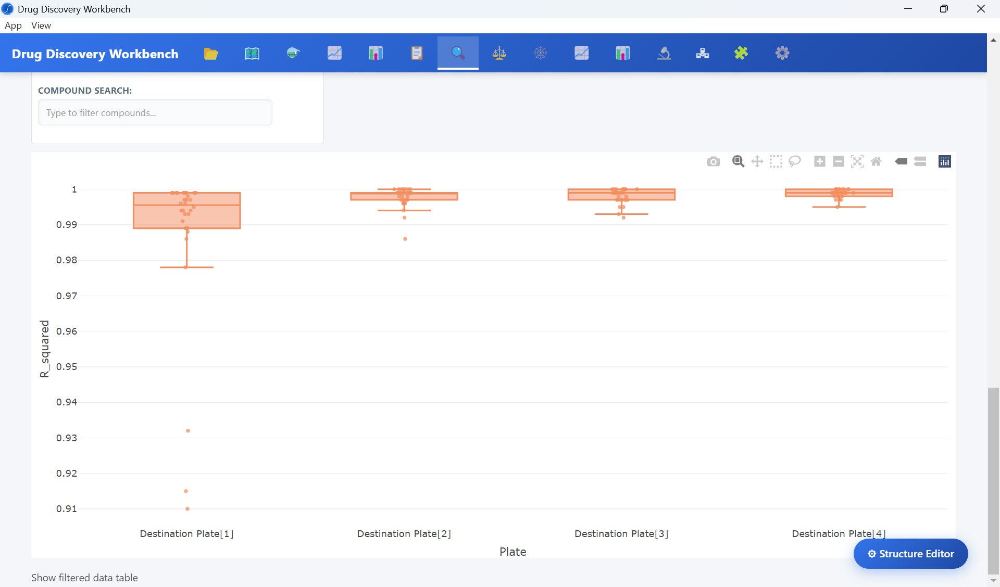
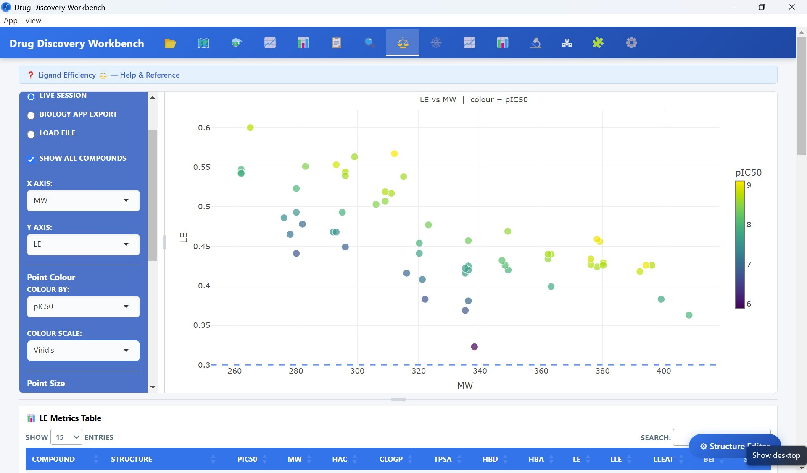
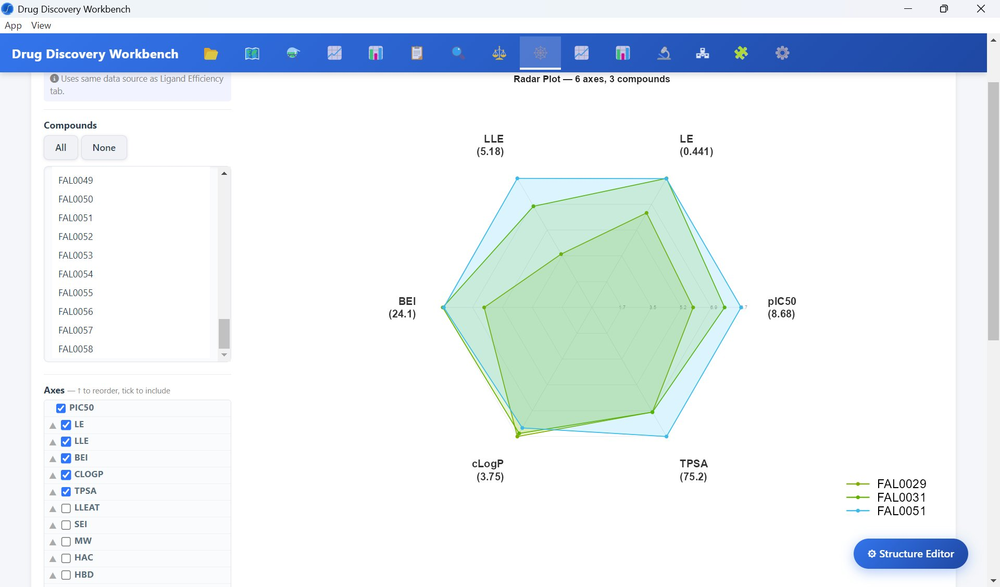
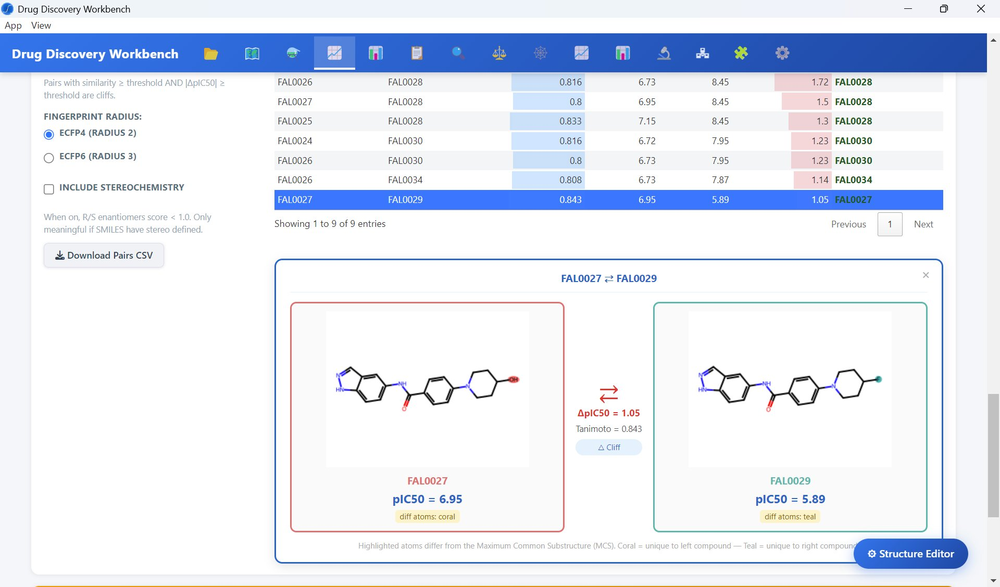
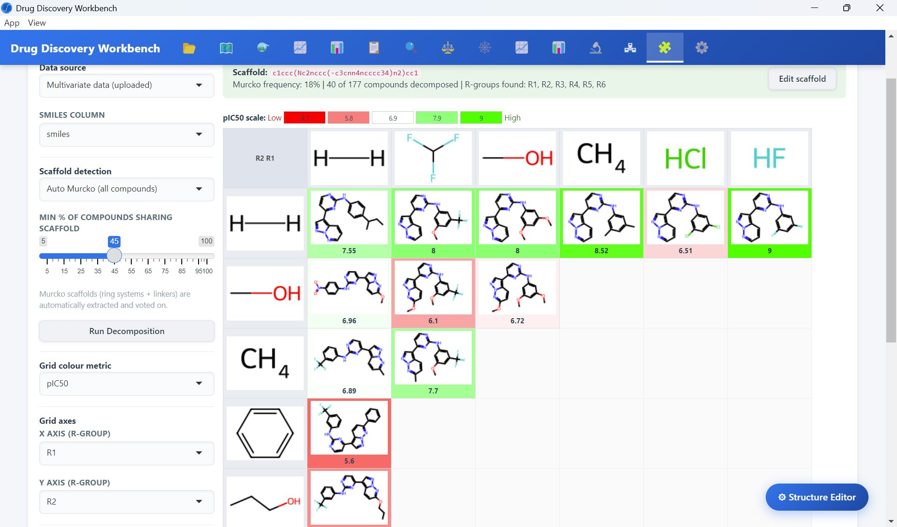
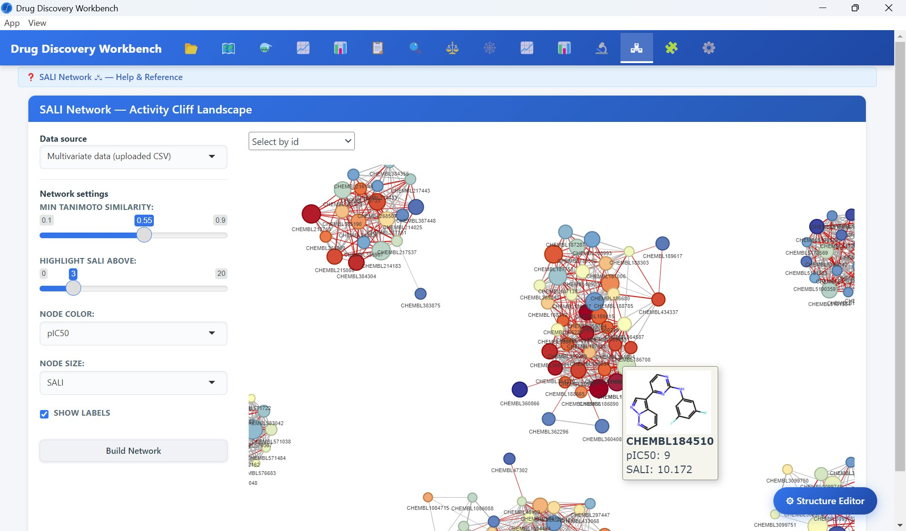

# Drug Discovery Workbench

A desktop application suite for small molecule drug discovery — built for scientists who work at the intersection of HTS biology and medicinal chemistry. Handles the full analytical workflow from raw plate data through dose-response fitting, normalization QC, and cheminformatics-driven SAR analysis.

Built with R/Shiny wrapped in Electron. Runs locally with no server dependency.

---

## Features at a glance

- **Plate normalization** with per-plate reference compound QC and interactive well knockout
- **4PL dose-response fitting** with per-compound singlicate architecture and structure-on-hover
- **Data Explorer** with multi-chart QC views (box, scatter, violin, histogram, heatmap) and dynamic filters
- **Ligand efficiency metrics** — LE, LLE, BEI, LLEAT, SEI with color-mapped scatter and sortable table
- **Multi-parameter radar plots** for side-by-side compound profiling
- **Activity cliff detection** using Morgan fingerprints (ECFP4/ECFP6) with MCS-highlighted structure pairs
- **R-group decomposition** via Auto Murcko scaffold detection and RDKit, with pIC50-colored grid
- **SALI network visualization** — chemical similarity graph with activity cliff landscape, node size mapped to SALI score

---

## Workflow

### 1 — Plate normalization and QC

Normalized % activity heatmap across a full 384-well plate. Wells marked with ✕ are knocked out and excluded from downstream fitting. Reference compound controls are tracked per-plate with pass/fail QC flagging.

---

### 2 — Dose-response curve fitting

4PL curves fit per compound per plate. Hovering any data point displays the compound structure inline — no switching to a separate structure viewer. pIC50 annotations, curve quality badges, and Cheng-Prusoff Ki conversion are all available from this panel.

---

### 3 — Data Explorer and fit QC

Interactive multi-chart explorer for fitted results. The example below shows R² distribution across destination plates — a fast way to spot plates with systematic fitting issues. Supports scatter, box, violin, bar, histogram, line, and heatmap chart types with simultaneous color and size mapping, dynamic compound filters, and faceting.

---

### 4 — Ligand efficiency

LE vs MW scatter colored by pIC50 (Viridis scale) with a LE = 0.3 reference line. Axes and color metric are fully configurable. The LE Metrics Table below the plot shows LE, LLE, BEI, LLEAT, SEI, HAC, TPSA, HBD, HBA, and cLogP for all compounds with sortable columns and structure thumbnails.

---

### 5 — Multi-parameter radar

Side-by-side compound profiling across up to 10 user-selected axes. Axis order is drag-to-reorder. Useful for rapid triage of compounds that score well across potency, efficiency, and physicochemical properties simultaneously.

---

### 6 — Activity cliff detection

Compound pairs ranked by ΔpIC50 with configurable Tanimoto similarity threshold and ECFP4/ECFP6 fingerprint radius. Selecting a row displays the pair side-by-side with MCS-based atom highlighting — atoms unique to each structure are colored coral vs teal, making the SAR-relevant difference immediately visible.

---

### 7 — R-group decomposition

Scaffold detection via Auto Murcko, Auto MCS/MMP, or manual SMARTS entry. Decomposes matched compounds into an R1 × R2 grid with structure thumbnails colored by pIC50. Green borders = high potency, red = low. Supports up to 6 R-group positions with configurable grid axes.

---

### 8 — SALI network

Chemical similarity network where node color encodes pIC50 and node size encodes SALI score. Edges connect compound pairs above the Tanimoto similarity threshold — red edges flag activity cliffs. Hovering a node shows the structure, pIC50, and SALI score inline. Configurable similarity threshold and cliff highlight cutoff via sliders.

---

## Architecture

The suite is split into three Electron desktop apps sharing a common R/Shiny backend:

| App | Focus |
|-----|-------|
| **HTS Assay Workbench** | Plate normalization, dose-response fitting, Data Explorer |
| **SAR Workbench** | Ligand efficiency, radar, activity cliffs, R-group decomposition, SALI network |
| **Analysis Suite** | Combined cross-app workflows and reporting |

Each app runs as a local Shiny server embedded in Electron — no internet connection required, no data leaves the machine.

---

## Dependencies

**R packages:** `shiny`, `plotly`, `ggplot2`, `dplyr`, `DT`, `visNetwork`, `reticulate`

**Python (via reticulate):** `rdkit`, `numpy`

**Runtime:** Electron, Node.js

---

## Background

Built by a senior HTS/drug discovery scientist with 25+ years of experience across assay development, covalent inhibitor kinetics, BLI/GCI biophysics, and laboratory automation. Designed to replace fragmented Excel/Prism/Pipeline Pilot workflows with a single integrated environment that a bench scientist can actually use.

---

## Status

Active development. Contact Sandvik.erik@gmail.com for access or collaboration.

